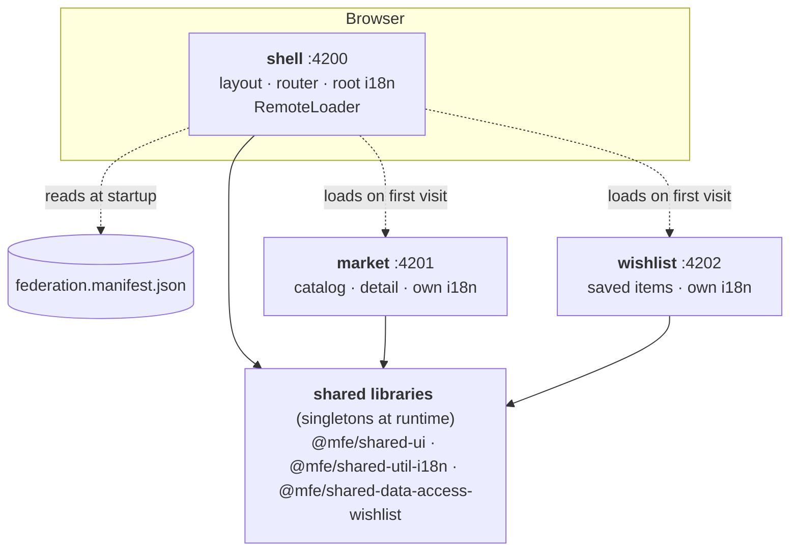

# MFE Store: micro-frontends with Nx, Angular 22 and Native Federation

<!-- docs:exclude-start -->

[](https://github.com/AlbertBCN33/micro-frontends/actions/workflows/ci.yml)

<!-- docs:exclude-end -->

A small store split into **three independently deployable Angular apps**,
composed at runtime. It's a reference for how I structure, test and document a
frontend platform that several teams could work on.

<!-- docs:exclude-start -->

## Contents

- [The problem](#the-problem)
- [What's inside](#whats-inside)
- [Quick start](#quick-start)
- [Decisions and tradeoffs](#decisions-and-tradeoffs) ·
  **[all Architecture Decision Records](docs/adr/README.md)**
- [Quality](#quality): [testing](#testing), [accessibility](#accessibility),
  [performance](#performance), [TypeScript](#typescript),
  [CI and versioning](#ci-and-versioning)
- [Deployment](#deployment)
- [How this was built](#how-this-was-built)
- [Repository layout](#repository-layout)

<!-- docs:exclude-end -->

> **Architecture Decision Records:** every significant choice in this repo,
> with its context, the alternatives and what it costs, is written up in
> **[docs/adr](docs/adr/README.md)**.

<!-- docs:exclude-start -->

> **Live demo:** coming soon (Firebase Hosting). To run it locally, see
> [Quick start](#quick-start).


| Dashboard                               | Wish list (Spanish)                                  | Architecture page                                     |
| --------------------------------------- | ---------------------------------------------------- | ----------------------------------------------------- |
|  |  |  |

<!-- docs:exclude-end -->

## The problem

Micro-frontends are easy to _start_ and hard to get _right_. The real work
isn't splitting an app in three; it's everything between the pieces:

- **Performance:** users should only download the parts they use.
- **Shared state:** the market saves an item, and the shell's header and
  the wishlist must agree, without the apps importing each other.
- **i18n:** every team owns its translations, yet the page speaks one
  language.
- **Resilience:** one broken deployment must not take the whole site down.
- **Governance:** shared code needs boundaries and versioning, or the
  "independent" apps become a distributed monolith.

This repo solves each of those explicitly, tests them end to end, and records
every decision in an [ADR](docs/adr/README.md).

## What's inside

<!-- docs:exclude-start -->



<!-- docs:exclude-end -->

| Project                            | Type   | Responsibility                                                                      |
| ---------------------------------- | ------ | ----------------------------------------------------------------------------------- |
| `apps/shell`                       | host   | Layout, navigation, language, dashboard, docs, lazy remote loading                  |
| `apps/shell/e2e`                   | e2e    | Journeys across apps and the shell's own pages, on the composed app (`shell-e2e`)   |
| `apps/market`                      | remote | Catalog with search, filters and sort (in the URL), product detail                  |
| `apps/market/e2e`                  | e2e    | Market-only journeys, on the standalone market (`market-e2e`)                       |
| `apps/wishlist`                    | remote | Saved products, totals, remove/clear                                                |
| `apps/wishlist/e2e`                | e2e    | Wishlist-only journeys, on the standalone wishlist (`wishlist-e2e`)                 |
| `libs/shared/ui`                   | ui     | Presentational components (card, title, empty/error/loading state) and theme tokens |
| `libs/shared/util-i18n`            | util   | Root and scoped translations, language preference, currency pipe, route titles      |
| `libs/shared/data-access-wishlist` | data   | The cross-app contract: `WishlistItem`, `WishlistStore`, storage port               |
| `libs/shared/util-e2e`             | e2e    | Shared Playwright fixtures: axe, clean device, fail on page errors                  |

The app documents itself: its **Documentation** page shows the system design,
an architecture diagram and this README. Run `npm run graph` to explore the Nx
dependency graph.

<!-- docs:exclude-start -->

## Quick start

Requires **Node 24 LTS** (see `.nvmrc`; Angular 22 needs ≥ 22.22 or ≥ 24.15).

```sh
npm ci
cp .env.example .env   # optional: Firebase web config (git-ignored)
npm start              # market → wishlist → shell, then open http://localhost:4200
```

Each remote also runs standalone, with its own dev harness:

```sh
npm start -- market    # http://localhost:4201
```

| Script                | What it does                                                                                    |
| --------------------- | ----------------------------------------------------------------------------------------------- |
| `npm start`           | Dev servers for all apps (started in order, see [ADR 0001](docs/adr/0001-native-federation.md)) |
| `npm test`            | Unit and component tests (Vitest), all projects                                                 |
| `npm run e2e`         | Builds the apps and runs every e2e suite (Playwright + axe) against production builds           |
| `npm run lint`        | ESLint, including module-boundary rules                                                         |
| `npm run typecheck`   | `tsc --noEmit` per project, including test files                                                |
| `npm run i18n:check`  | Key parity across languages and ICU syntax, per app                                             |
| `npm run serve:dist`  | Builds and serves the production output the way the static host will                            |
| `npm run deploy`      | Deploys the three apps to Firebase Hosting (see [deployment](docs/deployment.md))               |
| `npm run release:dry` | Preview the next versions and changelogs of the shared libraries                                |

<!-- docs:exclude-end -->

## Decisions and tradeoffs

The short version. Each point links to its ADR, with context and the
alternatives that lost. **The full list is in [docs/adr](docs/adr/README.md).**

1. **Native Federation, not webpack Module Federation.** Nx 23 deprecated
   its Angular Module Federation generators (removal in v24). Native
   Federation runs on Angular's default esbuild builder and uses web standards
   (ES modules and import maps). _Cost:_ a young toolchain; I hit a dev-server
   cache race and documented a workaround. → [ADR 0001](docs/adr/0001-native-federation.md)

2. **Remotes are fetched on first visit, not at startup.** The shell starts
   with zero remotes registered and reads their URLs from a runtime manifest,
   so each environment is configured without rebuilding. A broken remote
   degrades to a contained error page. _Cost:_ one extra round trip on the
   first visit to each section. → [ADR 0002](docs/adr/0002-lazy-remotes-runtime-manifest.md)

3. **Cross-app state through a tiny versioned contract**, not events or a
   global store. The wishlist stores _snapshots_, so it never calls the
   market's API. _Cost:_ a shared singleton is runtime coupling. It is made
   explicit with versioning and `strictVersion`, and covered by e2e.
   → [ADR 0003](docs/adr/0003-cross-app-state-contract.md)

4. **Each app ships its own translations** (`src/assets/i18n`) through
   ngx-translate child scopes. Files are content-hashed chunks served from the
   owning app's origin, with ICU plurals and number formatting. _Cost:_
   runtime i18n is heavier than Angular's compile-time i18n, which in exchange
   needs one build per locale per app. → [ADR 0004](docs/adr/0004-per-app-translations.md)

5. **No backend.** The catalog is a static file behind injection tokens and a
   validating parser, so a real API is a one-line swap. MSW was planned and
   dropped because it added no coverage over Playwright request interception.
   → [ADR 0005](docs/adr/0005-no-backend.md)

6. **Client-side rendering only**, which fits static hosting. SEO for product
   pages is the known cost. → [ADR 0006](docs/adr/0006-client-side-rendering.md)

7. **Boundaries are enforced, not documented.** Tags plus lint rules make
   remote-to-remote imports impossible. Code becomes a shared library when
   it gets a _second consumer_, not before.
   → [ADR 0007](docs/adr/0007-library-boundaries.md)

## Quality

### Testing

→ [ADR 0008](docs/adr/0008-testing-strategy.md)

- **81 unit and component tests** (Vitest). Every page and layout component
  is tested through its rendered output with real routing and the app's real
  translation files, so a missing key fails a test. They also cover parsers,
  filters, the store, language resolution, and the federation loader (lazy
  registration, deduplication, retry, contract violations).
- **29 end-to-end scenarios** (Playwright, run on desktop and mobile) on
  production builds, **owned by the app whose journey they test**:
    - each remote's suite (`apps/<remote>/e2e`) tests journeys that stay inside
      that remote, against the remote's _standalone_ build, so its team can
      verify and ship without the shell;
    - the shell's suite tests journeys that cross apps (lazy loading counted per
      origin, cross-app state, i18n across apps, a remote going down) and the
      shell's own pages, keyboard and focus flows.

    Nx runs only the suites a change affects: a market change runs the market's
    suite plus the shell's cross-app suite; a shell-only change never runs the
    remotes' suites. Any uncaught page error fails the test.

### Accessibility

- **axe-core, WCAG 2.2 A/AA, on every page** in e2e (each app audits its own
  pages, the shell also audits composed pages); no violations allowed.
- A skip link, focus moved to `<main>` on route changes (but not on
  search-as-you-type), `aria-current` on navigation, and `aria-pressed` on
  toggles.
- Removals are announced through live regions. Errors use `role="alert"`.
- `<html lang>` follows the language switch.
- Colors meet AA contrast in both light and dark mode, 44 px touch targets,
  and `prefers-reduced-motion` is respected.

### Performance

- The shell's initial JavaScript is about **40 kB transferred**. Angular, RxJS
  and shared libraries arrive once, as long-cacheable shared bundles.
- A remote costs nothing until it's visited. Translations load per language
  and per app. The documentation README and its Markdown renderer load only
  when that tab is opened.
- Zoneless change detection, signals, and `httpResource`. OnPush is the
  default in Angular 22.

### TypeScript

- `strict`, `strictTemplates`, `noPropertyAccessFromIndexSignature`, and
  runtime validation wherever data crosses a trust boundary (API payloads,
  localStorage).
- Components keep templates and styles in their own files; lint enforces it.

### CI and versioning

- **CI** ([`ci.yml`](.github/workflows/ci.yml)) runs format, i18n, then
  lint, typecheck, test and build on **affected projects only**, with the Nx
  cache persisted between runs. Only affected e2e suites run, one at a time.
- **Release** ([`release.yml`](.github/workflows/release.yml)) runs
  `nx release` on the shared libraries. It uses conventional commits,
  independent versions, per-library changelogs and git tags. Versions are
  written to the source `package.json` that Native Federation enforces at
  runtime.

## Deployment

Each app is its own **Firebase Hosting** site (free Spark plan) and deploys on
its own. Every push to `main` runs CI and, **only if it passes**, deploys the
affected apps (remotes first, then the shell), writes the production
federation manifest and verifies the live sites (CORS, caching, manifest).
Setup, rollback and manual full deploys are in
**[docs/deployment.md](docs/deployment.md)**; the reasoning is in
[ADR 0009](docs/adr/0009-deployment.md).

## How this was built

This project was built with **Claude Code** as the implementer, under my direction.
I'm stating it plainly, because how I work with AI tooling is also part of what this repository shows.

**What I owned**

- **The starting point:** the original Nx workspace and the Angular v18 micro-frontends.
- **The requirements:** an Nx monorepo with shared packages, versioning and CI
  caching; the latest Angular version; each app loading its own translation files;
  remotes downloaded only when their URL is visited; Firebase Hosting.
- **The decisions where there was a real choice:** rebuilding on Nx 23 instead
  of migrating step by step, dropping SSR, the product-catalog domain, no
  custom backend, and naming the remotes after their domains.
- **Review, and the conventions that came out of it:** e2e tests live with the
  app that owns the journey; every page and layout component has a spec;
  templates and styles live in their own files; translations sit in
  `src/assets/i18n` instead of the root app folder; the README doubles as an in-app documentation tab.

**What Claude Code did**

- Researched the current toolchain options.
- Wrote most of the code, the tests and the documentation.

**How it was verified**

- Every change passed the same gates CI runs: formatting, translation checks,
  lint with module boundaries, type checks, unit and component tests,
  production builds, and end-to-end tests with axe accessibility audits on
  desktop and mobile.

## Repository layout

```
apps/
  shell/                  host: layout, dashboard, docs, federation/
    e2e/                  cross-app journeys + shell pages (shell-e2e)
    src/assets/i18n/      en.json, es.json
  market/                 remote: catalog/, product-detail/, data/
    e2e/                  market-only journeys (market-e2e)
    src/assets/i18n/      en.json, es.json
  wishlist/               remote: wishlist-page/
    e2e/                  wishlist-only journeys (wishlist-e2e)
    src/assets/i18n/      en.json, es.json
libs/shared/
  ui/                     presentational components + theme.css
  util-i18n/              translation providers, language preference
  data-access-wishlist/   cross-app contract
  util-e2e/               shared Playwright fixtures
tools/scripts/            serve-all, serve-dist, check-i18n, generate-env,
                          write-manifest, verify-deploy
docs/adr/                 architecture decision records
docs/deployment.md        Firebase Hosting setup and continuous deployment
firebase.json             Hosting sites and headers (.firebaserc: site IDs)
```
