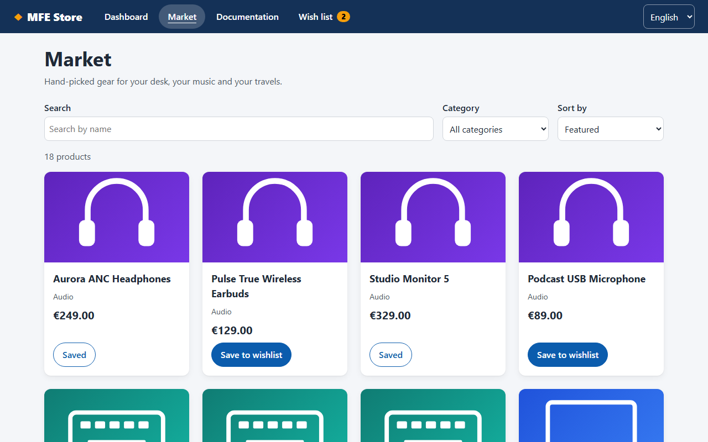
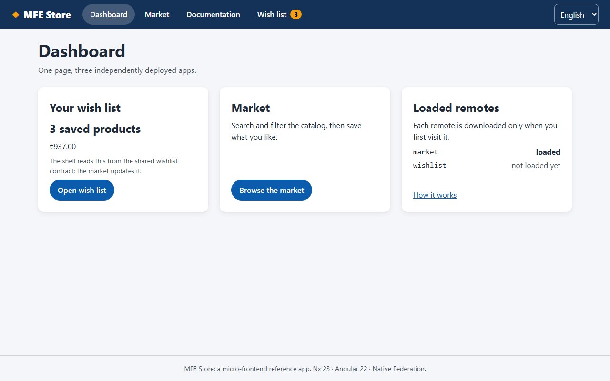
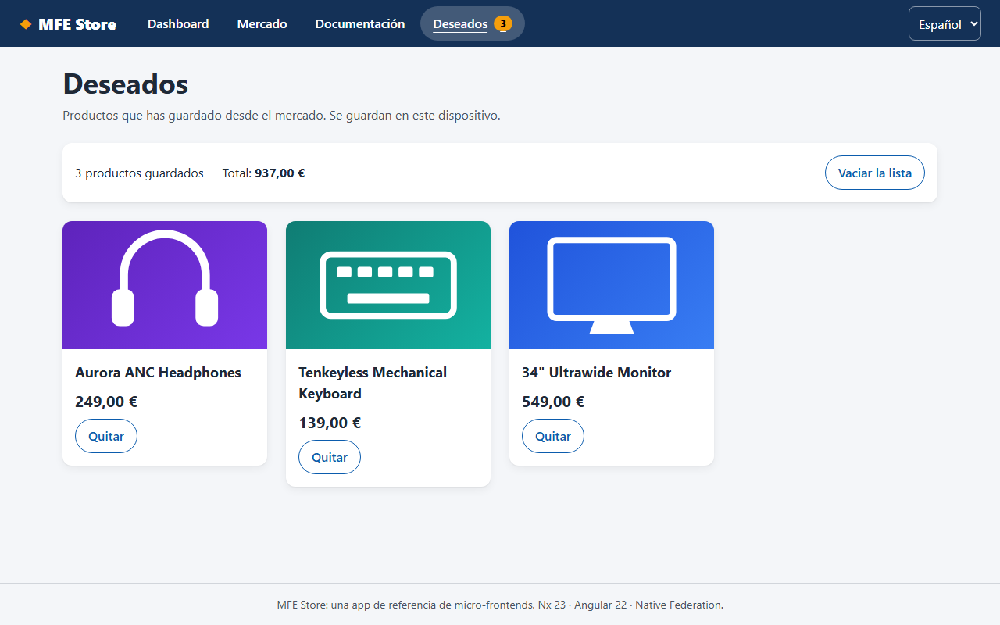
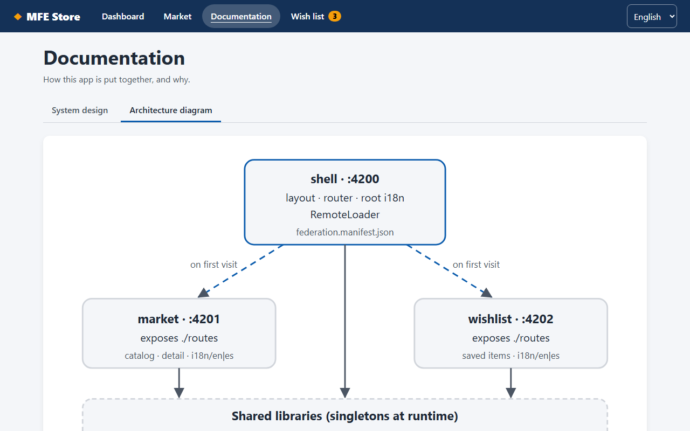
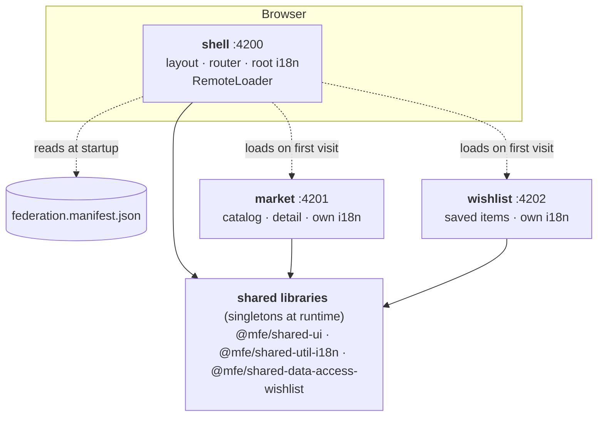

# MFE Store: micro-frontends with Nx, Angular 22 and Native Federation

[](https://github.com/AlbertBCN33/micro-frontends/actions/workflows/ci.yml)

A small store split into **three independently deployable Angular apps**,
composed at runtime. It's a reference for how I structure, test and document a
frontend platform that several teams could work on.

> **Live demo:** coming soon (Firebase Hosting). To run it locally, see
> [Quick start](#quick-start).



| Dashboard                               | Wish list (Spanish)                                  | Architecture page                                     |
| --------------------------------------- | ---------------------------------------------------- | ----------------------------------------------------- |
|  |  |  |

## The problem

Micro-frontends are easy to _start_ and hard to get _right_. The real work
isn't splitting an app in three; it's everything between the pieces:

- **Performance:** users should only download the parts they use.
- **Shared state:** the market saves an item, and the shell's header and
  the wishlist must agree, without the apps importing each other.
- **i18n:** every team owns its translations, yet the page speaks one
  language.
- **Resilience:** one broken deployment must not take the whole site down.
- **Governance:** shared code needs boundaries and versioning, or the
  "independent" apps become a distributed monolith.

This repo solves each of those explicitly, tests them end to end, and records
every decision in an ADR.

## What's inside



| Project                            | Type   | Responsibility                                                                      |
| ---------------------------------- | ------ | ----------------------------------------------------------------------------------- |
| `apps/shell`                       | host   | Layout, navigation, language, dashboard, docs, lazy remote loading                  |
| `apps/market`                      | remote | Catalog with search, filters and sort (in the URL), product detail                  |
| `apps/wishlist`                    | remote | Saved products, totals, remove/clear                                                |
| `libs/shared/ui`                   | ui     | Presentational components (card, title, empty/error/loading state) and theme tokens |
| `libs/shared/util-i18n`            | util   | Root and scoped translations, language preference, currency pipe, route titles      |
| `libs/shared/data-access-wishlist` | data   | The cross-app contract: `WishlistItem`, `WishlistStore`, storage port               |
| `apps/shell-e2e`                   | e2e    | Playwright suite against the composed production build                              |

Run `npm run graph` to explore the dependency graph.

## Quick start

Requires **Node 24 LTS** (see `.nvmrc`; Angular 22 needs ≥ 22.22 or ≥ 24.15).

```sh
npm ci
npm start          # market → wishlist → shell, then open http://localhost:4200
```

Each remote also runs standalone, with its own dev harness:

```sh
npm start -- market    # http://localhost:4201
```

| Script                | What it does                                                                                    |
| --------------------- | ----------------------------------------------------------------------------------------------- |
| `npm start`           | Dev servers for all apps (started in order, see [ADR 0001](docs/adr/0001-native-federation.md)) |
| `npm test`            | Unit and component tests (Vitest), all projects                                                 |
| `npm run e2e`         | Builds everything and runs Playwright + axe against the production build                        |
| `npm run lint`        | ESLint, including module-boundary rules                                                         |
| `npm run typecheck`   | `tsc --noEmit` per project, including test files                                                |
| `npm run i18n:check`  | Key parity across languages and ICU syntax, per app                                             |
| `npm run serve:dist`  | Builds and serves the production output the way the static host will                            |
| `npm run release:dry` | Preview the next versions and changelogs of the shared libraries                                |

## Decisions and tradeoffs

The short version. Each point links to its ADR, with context and the
alternatives that lost.

1. **Native Federation, not webpack Module Federation.** Nx 23 deprecated
   its Angular Module Federation generators (removal in v24). Native
   Federation runs on Angular's default esbuild builder and uses web standards
   (ES modules and import maps). _Cost:_ a young toolchain; I hit a dev-server
   cache race and documented a workaround. → [ADR 0001](docs/adr/0001-native-federation.md)

2. **Remotes are fetched on first visit, not at startup.** The shell starts
   with zero remotes registered and reads their URLs from a runtime manifest,
   so each environment is configured without rebuilding. A broken remote
   degrades to a contained error page. _Cost:_ one extra round trip on the
   first visit to each section. → [ADR 0002](docs/adr/0002-lazy-remotes-runtime-manifest.md)

3. **Cross-app state through a tiny versioned contract**, not events or a
   global store. The wishlist stores _snapshots_, so it never calls the
   market's API. _Cost:_ a shared singleton is runtime coupling. It is made
   explicit with versioning and `strictVersion`, and covered by e2e.
   → [ADR 0003](docs/adr/0003-cross-app-state-contract.md)

4. **Each app ships its own translations** through ngx-translate child scopes.
   Files are content-hashed chunks served from the owning app's origin, with
   ICU plurals. _Cost:_ runtime i18n is heavier than Angular's compile-time
   i18n, which in exchange needs one build per locale per app.
   → [ADR 0004](docs/adr/0004-per-app-translations.md)

5. **No backend.** The catalog is a static file behind injection tokens and a
   validating parser, so a real API is a one-line swap. MSW was planned and
   dropped because it added no coverage over Playwright request interception.
   → [ADR 0005](docs/adr/0005-no-backend.md)

6. **Client-side rendering only**, which fits static hosting. SEO for product
   pages is the known cost. → [ADR 0006](docs/adr/0006-client-side-rendering.md)

7. **Boundaries are enforced, not documented.** Tags plus lint rules make
   remote-to-remote imports impossible. Code becomes a shared library when
   it gets a _second consumer_, not before.
   → [ADR 0007](docs/adr/0007-library-boundaries.md)

## Quality

### Testing

→ [ADR 0008](docs/adr/0008-testing-strategy.md)

- **47 unit and component tests** (Vitest): parsers, filters, the store,
  language resolution, and the federation loader (lazy registration,
  deduplication, retry, contract violations). Components are tested through
  roles and live regions.
- **37 end-to-end tests** (Playwright, desktop and mobile) on the production
  build. They cover lazy loading by counting requests per origin, cross-app
  state, i18n across apps, a remote going down, API failure with retry,
  and keyboard and focus flows. Any uncaught page error fails the test.

### Accessibility

- **axe-core, WCAG 2.2 A/AA, on every page** in e2e; no violations allowed.
- A skip link, focus moved to `<main>` on route changes (but not on
  search-as-you-type), `aria-current` on navigation, and `aria-pressed` on
  toggles.
- Removals are announced through live regions. Errors use `role="alert"`.
- `<html lang>` follows the language switch.
- Colors meet AA contrast in both light and dark mode, 44 px touch targets,
  and `prefers-reduced-motion` is respected.

### Performance

- The shell's initial JavaScript is about **40 kB transferred**. Angular, RxJS
  and shared libraries arrive once, as long-cacheable shared bundles.
- A remote costs nothing until it's visited. Translations load per language
  and per app.
- Zoneless change detection, signals, and `httpResource`. OnPush is the
  default in Angular 22.

### TypeScript

- `strict`, `strictTemplates`, `noPropertyAccessFromIndexSignature`, and
  runtime validation wherever data crosses a trust boundary (API payloads,
  localStorage).

### CI and versioning

- **CI** ([`ci.yml`](.github/workflows/ci.yml)) runs format, i18n, then
  lint, typecheck, test and build on **affected projects only**, with the Nx
  cache persisted between runs. Playwright only runs when the e2e project is
  affected.
- **Release** ([`release.yml`](.github/workflows/release.yml)) runs
  `nx release` on the shared libraries. It uses conventional commits,
  independent versions, per-library changelogs and git tags. Versions are
  written to the source `package.json` that Native Federation enforces at
  runtime.

## Repository layout

```
apps/
  shell/                  host: layout, dashboard, docs, federation/
  market/                 remote: catalog/, product-detail/, data/, i18n/
  wishlist/               remote: wishlist-page/, i18n/
  shell-e2e/              Playwright + axe
libs/shared/
  ui/                     presentational components + theme.css
  util-i18n/              translation providers, language preference
  data-access-wishlist/   cross-app contract
tools/scripts/            serve-all (dev), serve-dist (prod-like), check-i18n
docs/adr/                 architecture decision records
```

## Roadmap

- Deploy to Firebase Hosting: one site per app, CORS headers on the remotes,
  and a manifest per environment. Then add the live link above.
- Preview deployments per PR, and run the e2e suite against them
  (`BASE_URL=… npm run e2e`).
- Prefetch remotes on navigation intent, if real-user metrics justify it.
- Visual regression tests once the UI settles.
- Report the Native Federation dev-cache race upstream.
